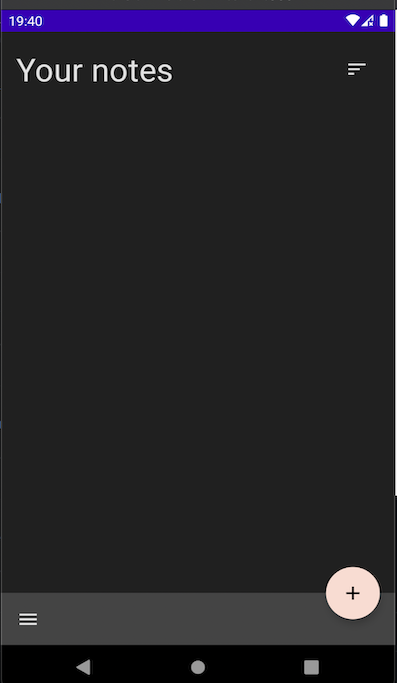
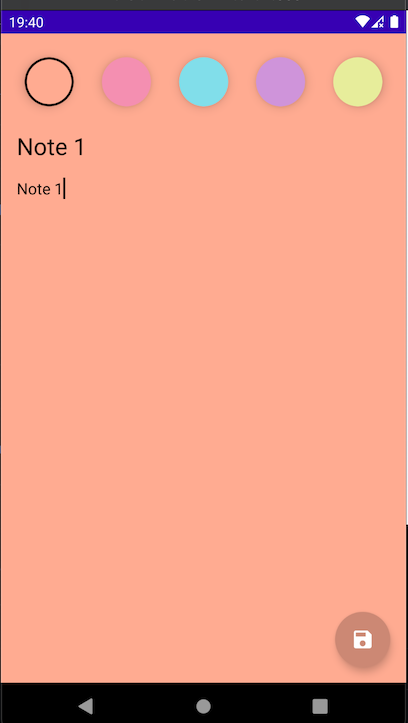
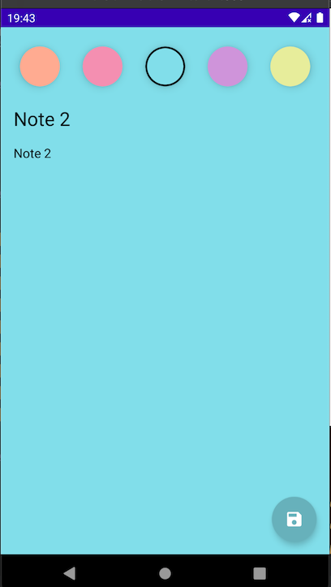
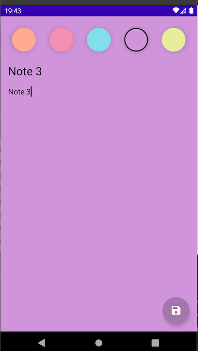
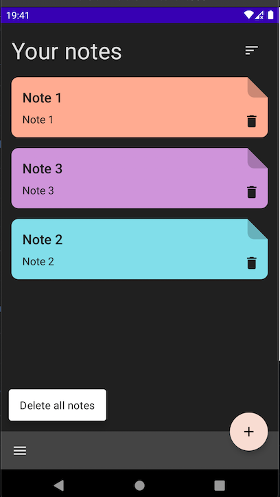
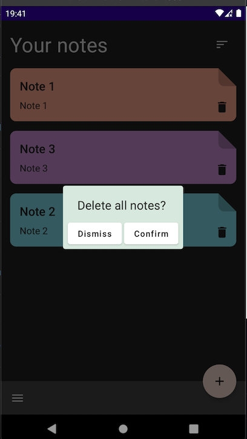

# Jetpack Compose Notes App

This is a simple application where you can add/edit and sort notes. When you create a note, you can
specify its color and then sort all created notes by date/time/color. The purpose of creating this
application is to get acquainted with Jetpack Compose technology.

## __Architecture__

* Architecture - Clean Architecture
* Presentation layer pattern - MVVM

## __Screenshots__

## Technologies

* [Jetpack Compose](https://developer.android.google.cn/jetpack/androidx/releases/compose?hl=en#declaring_dependencies)
* [Kotlin](https://developer.android.com/kotlin)
* [Room](https://developer.android.com/jetpack/androidx/releases/room)
* [ViewModel](https://developer.android.com/topic/libraries/architecture/viewmodel)
* [Kotlin Coroutines](https://developer.android.com/kotlin/coroutines)
* [Hilt](https://developer.android.com/training/dependency-injection/hilt-android)